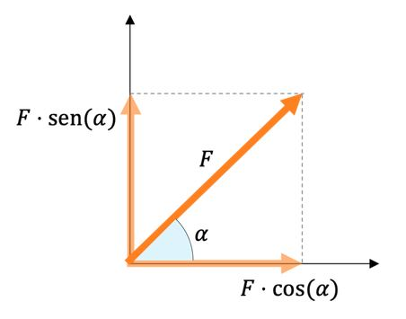

# ayudantía-01

viernes 11 agosto 2023

## resumen

### aceleración media

$$a = \frac{v(t_2) - v(t_1)}{t_2 - t_1}$$

### velocidad media

$$v = \frac{x(t_2) - x(t_1)}{t_2 - t_1}$$

### movimiento uniformemente acelerado

aceleración en el tiempo constante: 

$$a(t) = cte$$

velocidad en el tiempo: 

$$v(t) = v_{inicial} + a \cdot t$$

posición en el tiempo: 

$$x(t) = x_{inicial} + v_{inicial} \cdot t + \frac{1}{2} \cdot a \cdot t^2 $$

### segunda ley de newton

$$\vec{F} = m \cdot \vec{a}$$

### ley de gravitación universal

$$F_g = G\frac{m_1m_2}{r^2}$$

### aceleración de gravedad

$$g=9.8 \ [m/s^2]$$

### vectores

un vector es un objeto geométrico que representa una dirección y un sentido dentro de un sistema de coordenadas. En general se representa como una flecha.

el vector de dos dimensiones $\vec{V}$ de coordenadas $(V_x, V_y)$ se grafica de la siguiente manera: 

#### modulo, magnitud o amplitud de un vector $||\vec{V}||$

el módulo o amplitud de un vector nos dice su tamaño. 

$$||\vec{V}|| = \sqrt{V_x^2 + V_y^2}$$

#### componentes de un vector

teniendo el ángulo de un vector y su magnitud es posible calcular las componentes del vector utilizando trigonometría.

$$\vec{F} = (F \cdot cos(\alpha), F \cdot sen(\alpha))$$

## ejercicio-01: fuerza, masa y aceleración

Un vehículo de $100[kg]$ de masa se mueve en línea recta a $70[km/h]$. ¿Qué fuerza debe aplicarse en forma constante para que reduzca su velocidad a $20[km/h]$, 10 segundos después de aplicada la fuerza?

--- solución ---

calculamos la aceleración:

$$a=\frac{70[km/h] - 20[km/h]}{10[seg]}$$ 

$$a=\frac{50[km/h]}{10[seg]}$$ 

$$a=\frac{13.88[m/s]}{10[s]}$$ 

$$a=1.388[m/s^2]$$ 

por lo tanto la fuerza requerida es:

$$F=m \cdot a$$ 

$$F=100[kg] \cdot 1.388[m/s^2]$$ 

$$F=138.8[kg \cdot m/s^2]$$ 

$$F=138.8[N]$$ 

## ejercicio-02: movimiento uniformemente acelerado I

Un ciclista comienza su paseo matutino y al cabo de 10 segundos su velocidad es de $7.2 \ km/h$. En ese instante ve aproximarse un perro y comienza a frenar durante 6 segundos hasta que la bicicleta se detiene. Calcular:

a) La aceleración hasta que comienza a frenar.

b) La aceleración con la que frena la bicicleta.

c) La distancia total recorrida.

--- solución ---

a) 

$$a_1 = \frac{7.2 [\frac{km}{h}] - 0 [\frac{km}{h}]}{10[s] - 0[s]}$$

$$a_1 = \frac{7.2 [\frac{km}{h}]}{10[s]}$$

$$a_1 = \frac{2 [\frac{m}{s}]}{10[s]}$$

$$a_1 = \frac{1}{5}\left[\frac{m}{s^2}\right]$$

$$a_1 = 0.2\left[\frac{m}{s^2}\right]$$

b)

$$a_2 = \frac{0 [\frac{km}{h}] - 7.2 [\frac{km}{h}]}{16[s] - 10[s]}$$

$$a_2 = \frac{- 7.2 [\frac{km}{h}]}{6[s]}$$

$$a_2 = \frac{- 2 [\frac{m}{s}]}{6[s]}$$

$$a_2 = -\frac{1}{3}\left[\frac{m}{s^2}\right]$$

$$a_2 \approx -0.33\left[\frac{m}{s^2}\right]$$

c) La distancia total recorrida es la suma entre lo que recorrió en la primera fase y lo que recorrió la segunda fase.

Usando la fórmula para el movimiento uniformemente acelerado, en la primera fase:

$$x(t) = x_{inicial} + v_{inicial} \cdot t + \frac{1}{2} \cdot a \cdot t^2 $$

$$x(10[s]) = 0 + 0 \cdot 10[s] + \frac{1}{2} \cdot 0.2\left[\frac{m}{s^2}\right] \cdot (10[s])^2 $$

$$x(10(s)) = \frac{1}{2} \cdot 0.2\left[\frac{m}{s^2}\right] \cdot (10[s])^2 $$

$$x(10(s)) = 0.1\left[\frac{m}{s^2}\right] \cdot 100[s^2] $$

$$x(10(s)) = 10[m] $$

en la segunda fase:

$$x(6[s]) = 0 + 7.2 [\frac{km}{h}] \cdot 6[s] + \frac{1}{2} \cdot -0.33\left[\frac{m}{s^2}\right] \cdot (6[s])^2 $$

$$x(6[s]) = 0 + 2 [\frac{m}{s}] \cdot 6[s] + \frac{1}{2} \cdot -0.33\left[\frac{m}{s^2}
\right] \cdot (6[s])^2 $$

$$x(6[s]) = 12 [m] + \frac{1}{2} \cdot -0.33\left[\frac{m}{s^2}
\right] \cdot 36[s^2] $$

$$x(6[s]) = 12 [m] + -0.33\left[\frac{m}{s^2}
\right] \cdot 18[s^2] $$

$$x(6[s]) = 12 [m] - 5.94[m]$$

$$x(6[s]) = 6.06 [m]$$

finalmente sumando ambos resultados la distancia final es de $16.06 \ [m]$.

## ejercicio-03:  movimiento uniformemente acelerado II

Un atleta profesional debe recorrer 100 metros planos en una velocidad récord de 10 segundos.

a) ¿qué velocidad promedio debe alcanzar para lograr su meta?

b) si acelera de forma constante, ¿qué aceleración debe experimentar para lograr su meta?

c) grafique su aceleración en el tiempo.

d) grafique su velocidad en el tiempo.

e) grafique su posición en el tiempo.

--- solución ---

a)

$$v = \frac{100 [m] - 0 [m]}{10[s] - 0[s]}$$

$$v = \frac{100 [m]}{10[s]}$$

$$v = 10\left[\frac{m}{s}\right]$$

b)

$$x(t) = x_{inicial} + v_{inicial} \cdot t + \frac{1}{2} \cdot a \cdot t^2 $$

$$x(10[s]) = 0 + 0 \cdot 10[s] + \frac{1}{2} \cdot a \cdot (10[s])^2 $$

$$100[m] = \frac{1}{2} \cdot a \cdot (10[s])^2 $$

$$100[m] = \frac{1}{2} \cdot a \cdot 100[s^2] $$

$$\frac{100[m]}{100[s^2]} = \frac{1}{2} \cdot a $$

$$\frac{2 \cdot 100[m]}{100[s^2]} = a $$

$$a = \frac{2 \cdot 100[m]}{100[s^2]} $$

$$a = 2 \left[\frac{m}{s^2}\right] $$

c) el gráfico se realizó en clases

d) el gráfico se realizó en clases

e) el gráfico se realizó en clases

## ejercicio-04: fuerza, velocidad y aceleración como vectores

a) si una pelota de basketball se mueve a una velocidad constante de $\vec{v} = (2, 3) [m/s]$, responda:

- ¿cuál es su velocidad en el eje $\hat{x}$ de coordenadas?

- ¿cuál es su velocidad en el eje $\hat{y}$ de coordenadas?

- ¿en qué eje de coordenadas se desplazará más rápido?

- Calcule la velocidad lineal de la pelota.

--- solución ---

- su velocidad en el eje $\hat{x}$ es de $2 [m/s]$.

- su velocidad en el eje $\hat{y}$ es de $3 [m/s]$.

- se desplazará más rápido en el eje $\hat{y}$ (hacia arriba).

- para encontrar la velocidad lineal de la pelota, calculamos la magnitud del vector velocidad:

$$||\vec{v}|| = \sqrt{v_x^2 + v_y^2}$$

$$||\vec{v}|| = \sqrt{2^2 + 3^2}$$

$$||\vec{v}|| = \sqrt{4 + 9}$$

$$||\vec{v}|| = \sqrt{13}$$

$$||\vec{v}|| \approx 3.605 \ [m/s]$$

b) si una pelota de tenis de $50[g]$ es golpeada con una fuerza de $20[N]$ con un ángulo de incidencia $60°$.

- Calcule el vector fuerza ejercido a la pelota al momento de ser golpeada.

- ¿En qué eje de coordenadas recibe mayor fuerza?

- Calcule el vector aceleración ejercida en la pelota al momento de ser golpeada.

- Calcule la aceleración lineal ejercida en la pelota al momento de ser golpeada.

--- solución ---

- para calcular el vector fuerza utilizamos trigonometría:

$$\vec{F} = (F \cdot cos(\alpha), F \cdot sen(\alpha))$$

$$\vec{F} = (20[N] \cdot cos(60°), 20[N] \cdot sen(60°))$$

$$\vec{F} \approx (10, 17.32) [N]$$

- por lo tanto, recibe una fuerza mayor en el eje $\hat{y}$ (hacia arriba).

- para calcular la aceleración, aplicamos la versión vectorial de la segunda ley de newton:

$$\vec{F} = m \cdot \vec{a}$$

$$\vec{a} = \frac{\vec{F}}{m}$$

$$\vec{a} = \frac{(10, 17.32) [N]}{50[g]}$$

$$\vec{a} = \frac{(10, 17.32) [N]}{0.05[kg]}$$

$$\vec{a} = \left(\frac{10[N]}{0.05[kg]}, \frac{17.32[N]}{0.05[kg]}\right)$$

$$\vec{a} = (200[m/s^2], 346[m/s^2])$$

$$\vec{a} = (200, 346) \ [m/s^2]$$

- la aceleración lineal se calcula con el módulo del vector aceleración:

$$||\vec{a}|| = \sqrt{a_x^2 + a_y^2}$$

$$||\vec{a}|| = \sqrt{200^2 + 346^2}$$

$$||\vec{a}|| \approx 400 [m/s^2]$$

c) una bola de billar de $150[g]$ experimenta una aceleración vectorial constante $\vec{a} = (1,2)[m/s^2]$.

- Calcule el vector fuerza que experimenta.

- Asumiendo que la bola de billar parte en la posición $x=(0,0)[m]$ y velocidad $v=(0,0)[m/s]$, calcule el vector posición de la bola de billar en $t=2[s]$.

--- solución ---

    
- el vector fuerza se calcula utilizando la versión vectorial de la segunda ley de newton:

$$\vec{F} = m \cdot \vec{a}$$

$$\vec{F} = 150[g] \cdot (1,2)[m/s^2]$$

$$\vec{F} = 0.150[kg] \cdot (1,2)[m/s^2]$$

$$\vec{F} = (0.150[kg],2 \cdot 0.150[kg])[m/s^2]$$

$$\vec{F} = (0.150, 0.3)[kg \cdot m/s^2]$$

$$\vec{F} = (0.150, 0.3)[N]$$

- el vector posición en $t=2[s]$ utilizamos las fórmulas del movimiento uniformemente acelerado pero ahora de forma vectorial.

$$\vec{x}(t) = \begin{pmatrix} x_{1_{inicial}} + v_{1_{inicial}} \cdot t + \frac{1}{2} \cdot a_1 \cdot t^2  

\\ x_{2_{inicial}} + v_{2_{inicial}} \cdot t + \frac{1}{2} \cdot a_2 \cdot t^2  \end{pmatrix}$$

$$\vec{x}(2[s]) = \begin{pmatrix}0 + 0 \cdot 2[s] + \frac{1}{2} \cdot 1[m/s^2] \cdot (2[s])^2  

\\ 0 + 0 \cdot 2[s] + \frac{1}{2} \cdot 2[m/s^2] \cdot (2[s])^2  \end{pmatrix}$$

$$\vec{x}(2[s]) = \begin{pmatrix}\frac{1}{2} \cdot 1[m/s^2] \cdot 4[s^2]  

\\ \frac{1}{2} \cdot 2[m/s^2] \cdot 4[s^2]  \end{pmatrix}$$

$$\vec{x}(2[s]) = \begin{pmatrix}2[m]  

\\ 4[m]  \end{pmatrix}$$

