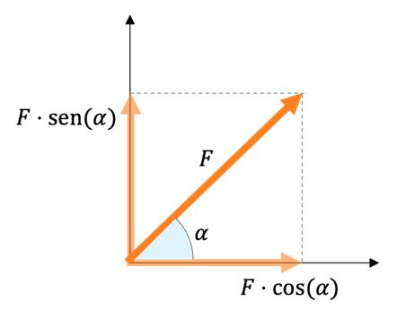

# ayudantía-03

viernes 1 septiembre 2023

## resumen

### vectores

un vector es un objeto geométrico que representa una dirección y un sentido dentro de un sistema de coordenadas. En general se representa como una flecha.

el vector de dos dimensiones $\vec{V}$ de coordenadas $(V_x, V_y)$ se grafica de la siguiente manera:


#### modulo, magnitud o amplitud de un vector $||\vec{V}||$

el módulo o amplitud de un vector nos dice su tamaño. 

$$||\vec{V}|| = \sqrt{V_x^2 + V_y^2}$$

#### vectores unitarios $\hat{V}$

son vectores de modulo igual a 1. 

a todos los vectores se les puede calcular su vector unitario:

$$\hat{V} = \frac{\vec{V}}{||\vec{V}||} $$

#### componentes de un vector

teniendo el ángulo de un vector y su magnitud es posible calcular las componentes del vector utilizando trigonometría.

$$\vec{F} = (F \cdot cos(\alpha), F \cdot sen(\alpha))$$



## ejercicio-02: fuerza, velocidad y aceleración como vectores

a) si una pelota de basketball se mueve a una velocidad constante de $\vec{v} = (2, 3) [m/s]$, responda:

- ¿cuál es su velocidad en el eje $\hat{x}$ de coordenadas?

- ¿cuál es su velocidad en el eje $\hat{y}$ de coordenadas?

- ¿en qué eje de coordenadas se desplazará más rápido?

- Calcule la velocidad lineal de la pelota.

<details>
<summary>--- solución ---</summary>

- su velocidad en el eje $\hat{x}$ es de $2 [m/s]$.

- su velocidad en el eje $\hat{y}$ es de $3 [m/s]$.

- se desplazará más rápido en el eje $\hat{y}$ (hacia arriba).

- para encontrar la velocidad lineal de la pelota, calculamos la magnitud del vector velocidad:

$$||\vec{v}|| = \sqrt{v_x^2 + v_y^2}$$

$$||\vec{v}|| = \sqrt{2^2 + 3^2}$$

$$||\vec{v}|| = \sqrt{4 + 9}$$

$$||\vec{v}|| = \sqrt{13}$$

$$||\vec{v}|| \approx 3.605 \ [m/s]$$

</details>

b) si una pelota de tenis de $50[g]$ es golpeada con una fuerza de $20[N]$ con un ángulo de incidencia $60°$.

- Calcule el vector fuerza ejercido a la pelota al momento de ser golpeada.

- ¿En qué eje de coordenadas recibe mayor fuerza?

- Calcule el vector aceleración ejercida en la pelota al momento de ser golpeada.

- Calcule la aceleración lineal ejercida en la pelota al momento de ser golpeada.

<details>
<summary>--- solución ---</summary>

- para calcular el vector fuerza utilizamos trigonometría:

$$\vec{F} = (F \cdot cos(\alpha), F \cdot sen(\alpha))$$

$$\vec{F} = (20[N] \cdot cos(60°), 20[N] \cdot sen(60°))$$

$$\vec{F} \approx (10, 17.32) [N]$$

- por lo tanto, recibe una fuerza mayor en el eje $\hat{y}$ (hacia arriba).

- para calcular la aceleración, aplicamos la versión vectorial de la segunda ley de newton:

$$\vec{F} = m \cdot \vec{a}$$

$$\vec{a} = \frac{\vec{F}}{m}$$

$$\vec{a} = \frac{(10, 17.32) [N]}{50[g]}$$

$$\vec{a} = \frac{(10, 17.32) [N]}{0.05[kg]}$$

$$\vec{a} = \left(\frac{10[N]}{0.05[kg]}, \frac{17.32[N]}{0.05[kg]}\right)$$

$$\vec{a} = (200[m/s^2], 346[m/s^2])$$

$$\vec{a} = (200, 346) \ [m/s^2]$$

- la aceleración lineal se calcula con el módulo del vector aceleración:

$$||\vec{a}|| = \sqrt{a_x^2 + a_y^2}$$

$$||\vec{a}|| = \sqrt{200^2 + 346^2}$$

$$||\vec{a}|| \approx 400 [m/s^2]$$


</details>


c) una bola de billar de $150[g]$ experimenta una aceleración vectorial constante $\vec{a} = (1,2)[m/s^2]$.

- Calcule el vector fuerza que experimenta.

- Asumiendo que la bola de billar parte en la posición $x=(0,0)[m]$ y velocidad $v=(0,0)[m/s]$, calcule el vector posición de la bola de billar en $t=2[s]$.

--- solución ---

- el vector fuerza se calcula utilizando la versión vectorial de la segunda ley de newton:

$$\vec{F} = m \cdot \vec{a}$$

$$\vec{F} = 150[g] \cdot (1,2)[m/s^2]$$

$$\vec{F} = 0.150[kg] \cdot (1,2)[m/s^2]$$

$$\vec{F} = (0.150[kg],2 \cdot 0.150[kg])[m/s^2]$$

$$\vec{F} = (0.150, 0.3)[kg \cdot m/s^2]$$

$$\vec{F} = (0.150, 0.3)[N]$$

- el vector posición en $t=2[s]$ utilizamos las fórmulas del movimiento uniformemente acelerado pero ahora de forma vectorial.

```math
\vec{x}(t) = \begin{pmatrix}x_{1_{inicial}} + v_{1_{inicial}} \cdot t + \frac{1}{2} \cdot a_1 \cdot t^2 \\ x_{2_{inicial}} + v_{2_{inicial}} \cdot t + \frac{1}{2} \cdot a_2 \cdot t^2 \end{pmatrix}
```

```math
$$\vec{x}(2[s]) = \begin{pmatrix}0 + 0 \cdot 2[s] + \frac{1}{2} \cdot 1[m/s^2] \cdot (2[s])^2 \\ 0 + 0 \cdot 2[s] + \frac{1}{2} \cdot 2[m/s^2] \cdot (2[s])^2  \end{pmatrix}$$
```

```math
$$\vec{x}(2[s]) = \begin{pmatrix}\frac{1}{2} \cdot 1[m/s^2] \cdot 4[s^2] \\ \frac{1}{2} \cdot 2[m/s^2] \cdot 4[s^2]  \end{pmatrix}$$
```

```math
$$\vec{x}(2[s]) = \begin{pmatrix}2[m] \\ 4[m] \end{pmatrix}$$
```
