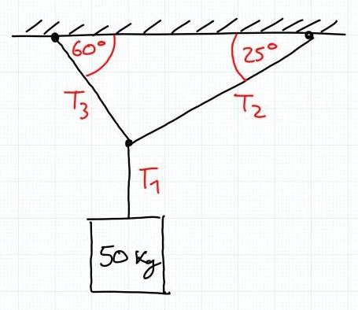
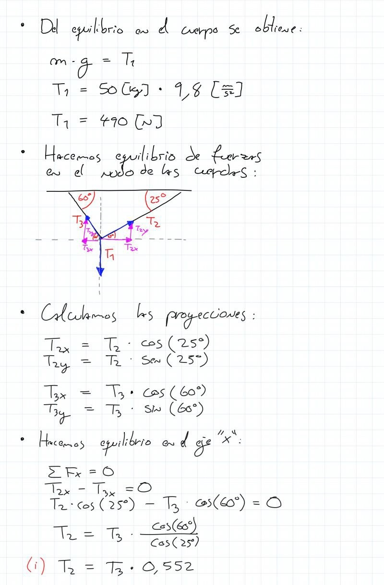
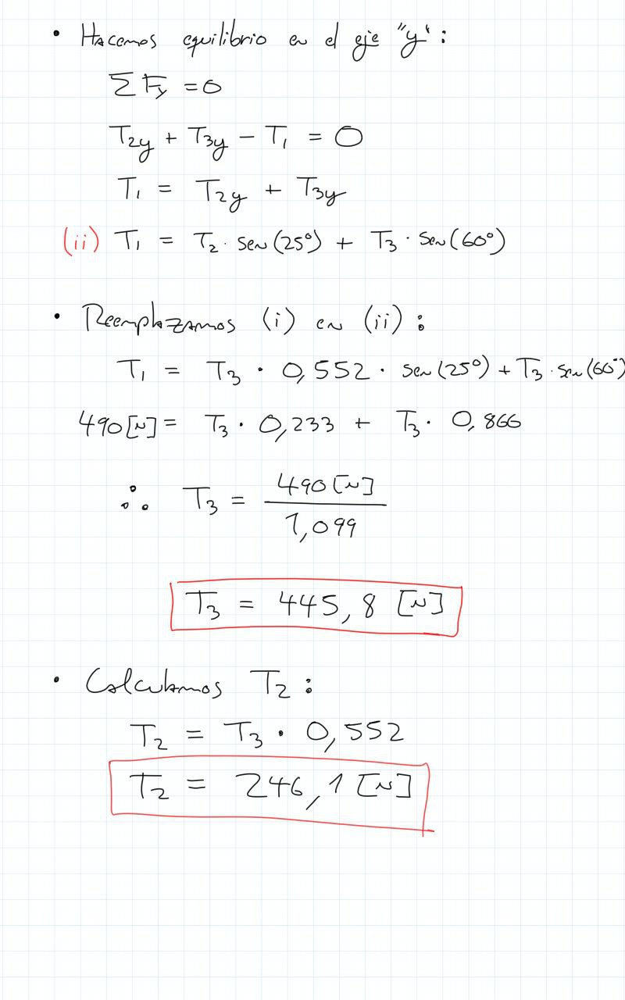

# ayudantía-05

viernes 8 septiembre 2023

## resumen

## ejercicio-01

necesito subir un piano de $150[kg]$ a un departamento a través de una rampa con una inclinación de $20°$ y coeficiente de roce $\mu=0.2$. 

¿Qué fuerza mínima debo aplicar para compensar la fuerza de peso $\vec{W}$ y de roce $\vec{F_r}$, y poder empezar a subir el piano?

### --- solución ---

## ejercicio-02

un saco de cemento de $50[kg]$ cuelga en equilibrio estático como en la siguiente figura:

Calcule la tensión entre las cuerdas $T1$, $T2$ y $T3$.

### --- solución ---

## ejercicio-03

desde el suelo se lanza verticalmente hacia arriba una pelota de masa $m=10[kg]$ y velocidad inicial $v_i = 30 [m/s]$.

calcule:

a) la energía de la pelota en el momento inicial.

b) la altura máxima que alcanza la pelota.

### --- solución ---

