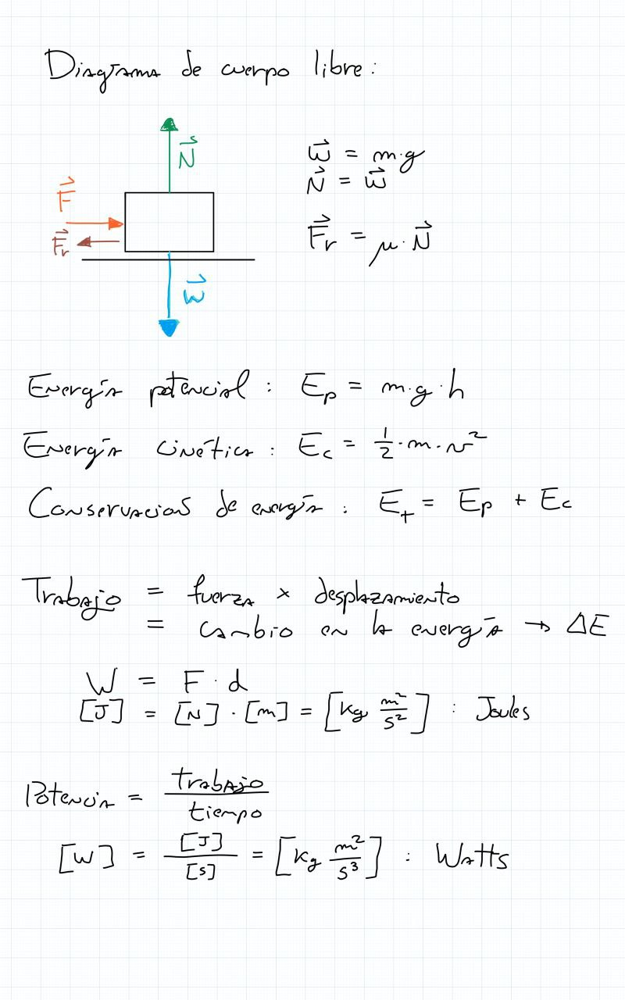
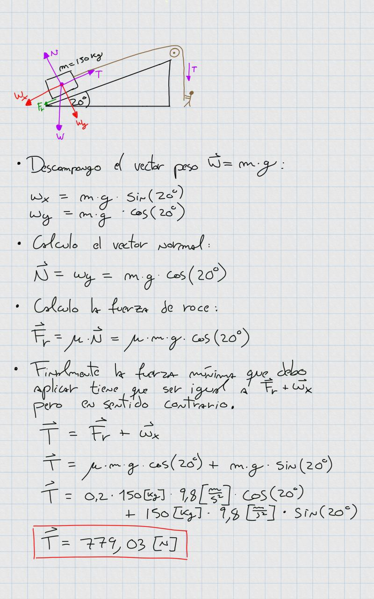
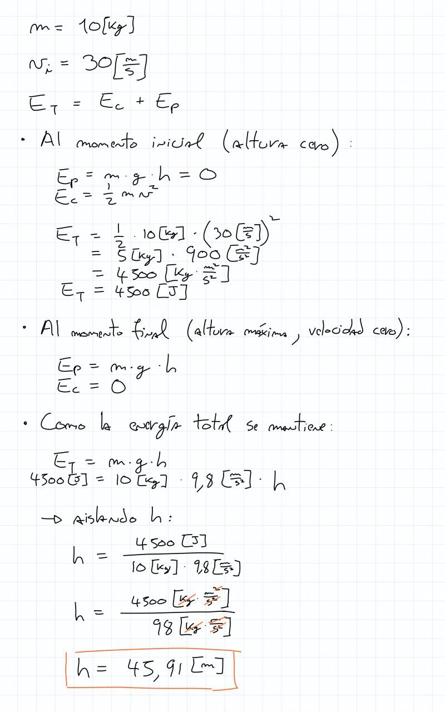
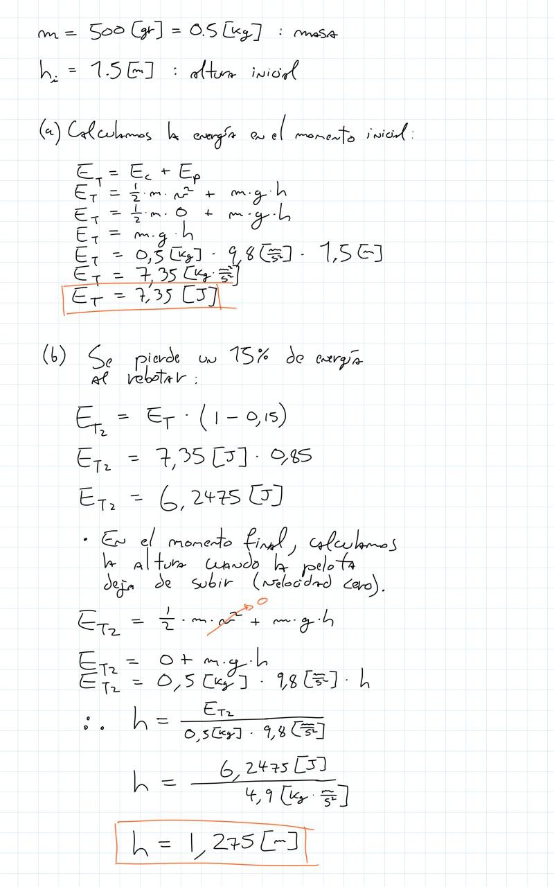
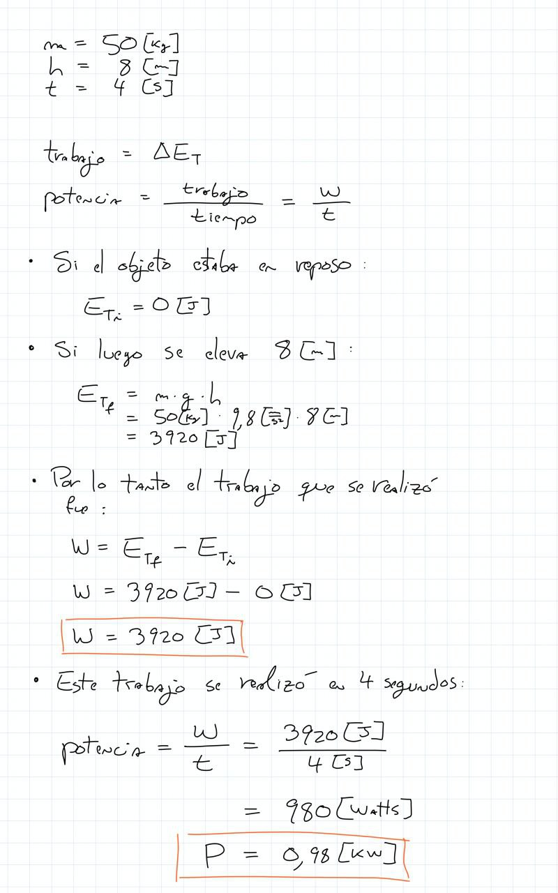

# ayudantía-04

viernes 8 septiembre 2023

## resumen

## ejercicio-01

necesito subir un piano de $150[kg]$ a un departamento a través de una rampa con una inclinación de $20°$ y coeficiente de roce $\mu=0.2$. 

¿Qué fuerza mínima debo aplicar para compensar la fuerza de peso $\vec{W}$ y de roce $\vec{F_r}$, y poder empezar a subir el piano?

### --- solución ---

## ejercicio-02

## ejercicio-03

desde el suelo se lanza verticalmente hacia arriba una pelota de masa $m=10[kg]$ y velocidad inicial $v_i = 30 [m/s]$.

calcule:

a) la energía de la pelota en el momento inicial.

b) la altura máxima que alcanza la pelota.

### --- solución ---

## ejercicio-04

Una pelota de $500 [gr]$ se deja caer desde una altura de $1.5[m]$. Sabemos que cada vez que rebota pierde el 15% de su energía mecánica.

calcule:

a) la energía de la pelota en el momento inicial.

b) la altura máxima que alcanza la pelota después del primer bote.

### --- solución ---

## ejercicio-05

una grúa eleva un bloque de $50[kg]$ a una altura de $8[m]$ en $4[s]$.

a) ¿Qué trabajo realizó la grúa?

b) ¿Qué potencia tiene la grúa? expreselo en KiloWatts.

### --- solución ---

