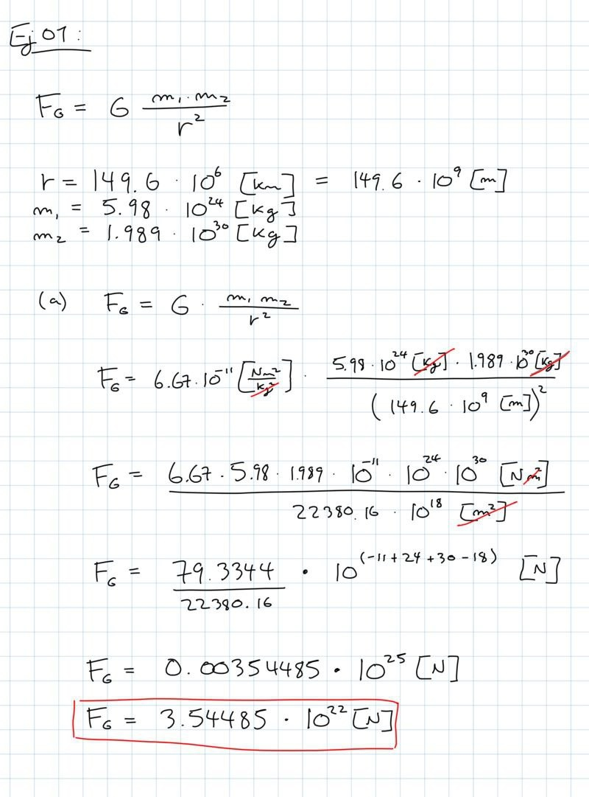
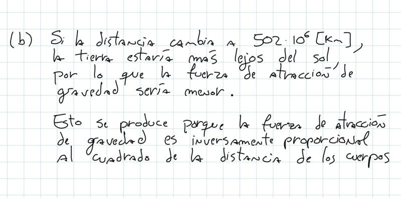
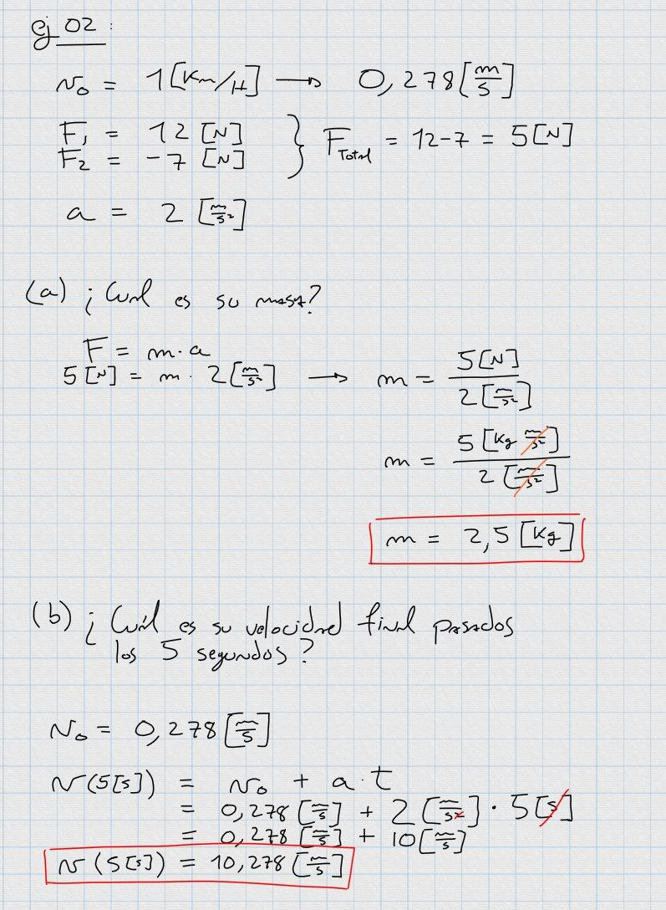
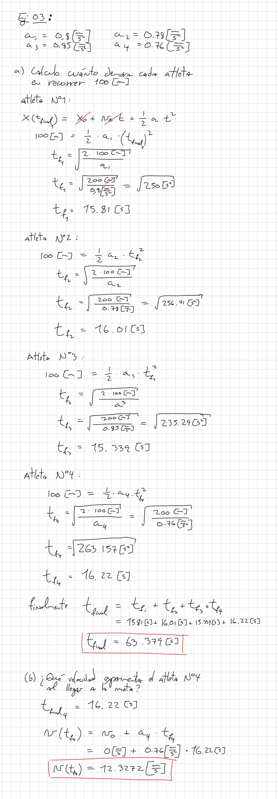
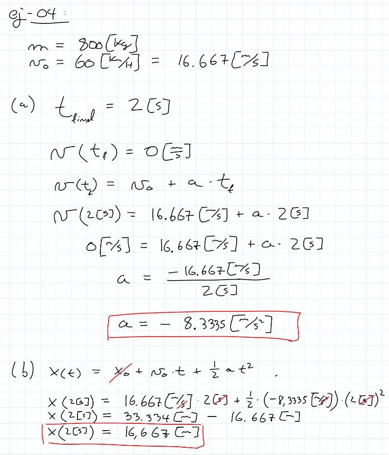

# control-01

viernes 25 agosto 2023, presencial

instrucciones:

* control individual
* entregar soluciones en hojas con nombre, fecha, número de ejercicio
* responder máximo 3 de los 4 ejercicios
* evaluaremos los 2 mejores ejercicios que contesten, el tercero no cuenta

pauta:
* cada control tiene 1 punto base, más 3 puntos por cada ejercicio considerado
* cada ejercicio tiene parte a) y b), cada una de 1.5 puntos máximo donde:
    * 1.5 puntos si el proceso está completo, y el resultado es correcto
    * 1.0 puntos si el proceso está completo, pero el resultado tiene errores menores
    * 0.5 puntos si el proceso empezó bien, pero luego hubo errores graves y resultado incorrecto
    * 0.0 puntos si está en blanco o el resultado y el proceso tienen errores gravísimos

---

### consejos: 

- usa calculadora y los apuntes del curso
- no olvides las unidades de medida
- $1[N] = 1[kg\frac{m}{s^2}]$
- $G = 6.67 \cdot 10^{-11} \left[\frac{Nm^2}{kg^2}\right]$

## ejercicio-01 (3 puntos)

a) calcule aproximadamente la fuerza de atracción de gravedad entre el sol y la tierra sabiendo que: 
- distancia entre la tierra y el sol = $149.6 \cdot 10^{6} \ [km]$
- masa de la tierra = $5.98 \cdot 10^{24} \ [kg]$
- masa del sol = $1.989 \cdot 10^{30} \ [kg]$

b) Si la distancia entre la tierra y el sol cambiara a $502 \cdot 10^{9} \ [km]$. La fuerza de atracción entre ambos astros ¿aumentaría, disminuirá o se mantendría? **Fundamente sin realizar cálculos.**

## ejercicio-02 (3 puntos)

Un cuerpo posee una velocidad de $1[km/h]$. Por 5 segundos recibe dos fuerzas contrarias $F_1 = 12[N]$ y $F_2=-7[N]$. Si durante ese tiempo el cuerpo experimenta una aceleración de $2[m/s^2]$:

a) ¿Cuál es su masa?

b) ¿Cuál es su velocidad final pasados los 5 segundos?

## ejercicio-03 (3 puntos)

Un grupo de cuatro atletas se prepara para una carrera de reelevos de 4x100 metros. 

Su entrenador ha logrado medir la aceleración promedio que alcanza cada atleta en sus carreras:

| Atleta  | Aceleración promedio | 
| ------------- | ------------- |
| N°1  | $0.8 [m/s^2]$  |
| N°2  | $0.78 [m/s^2]$  |
| N°3  | $0.85 [m/s^2]$  |
| N°4  | $0.76 [m/s^2]$  |

a) Si cada atleta debe recorrer $100[m]$ planos. ¿Cuál será el tiempo total esperado de la carrera?. (Cada atleta parte con una velocidad inicial de $0[m/s]$)

b) ¿Qué velocidad experimenta el atleta N°4 al momento de llegar a la meta?

## ejercicio-04 (3 puntos)

Un vehículo de $800[kg]$ de masa se mueve en línea recta a $60[km/h]$. Sorpresivamente se encuentra con un peatón y debe frenar brúscamente. 

a) ¿Qué aceleración promedio deben aplicar los frenos para detenerlo en 2 segundos?

b) ¿Cuántos metros recorre mientras está frenando?

