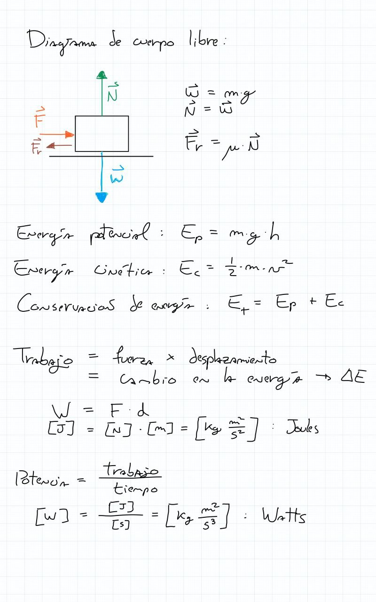
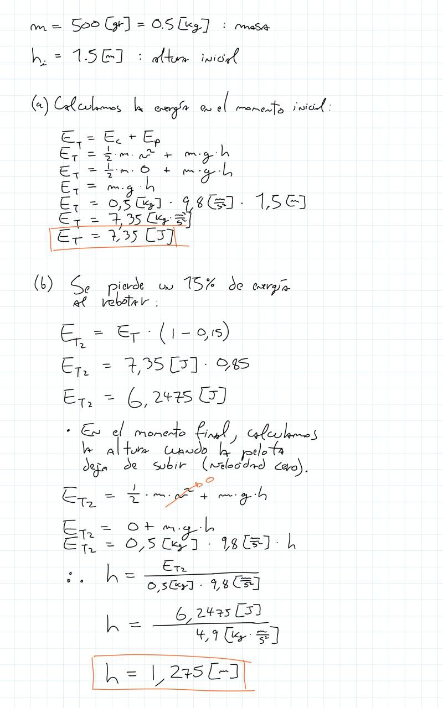
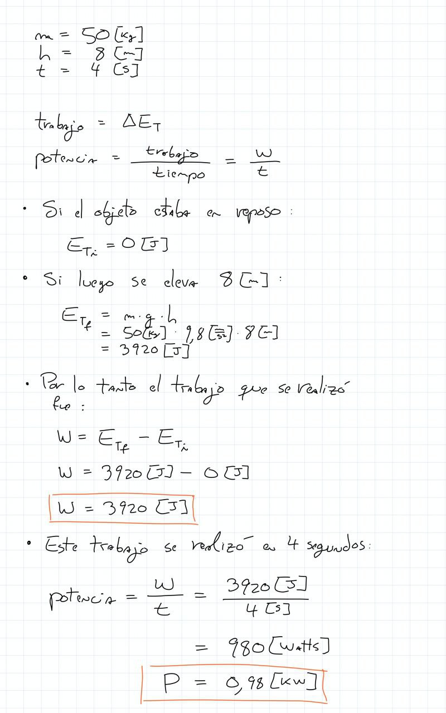
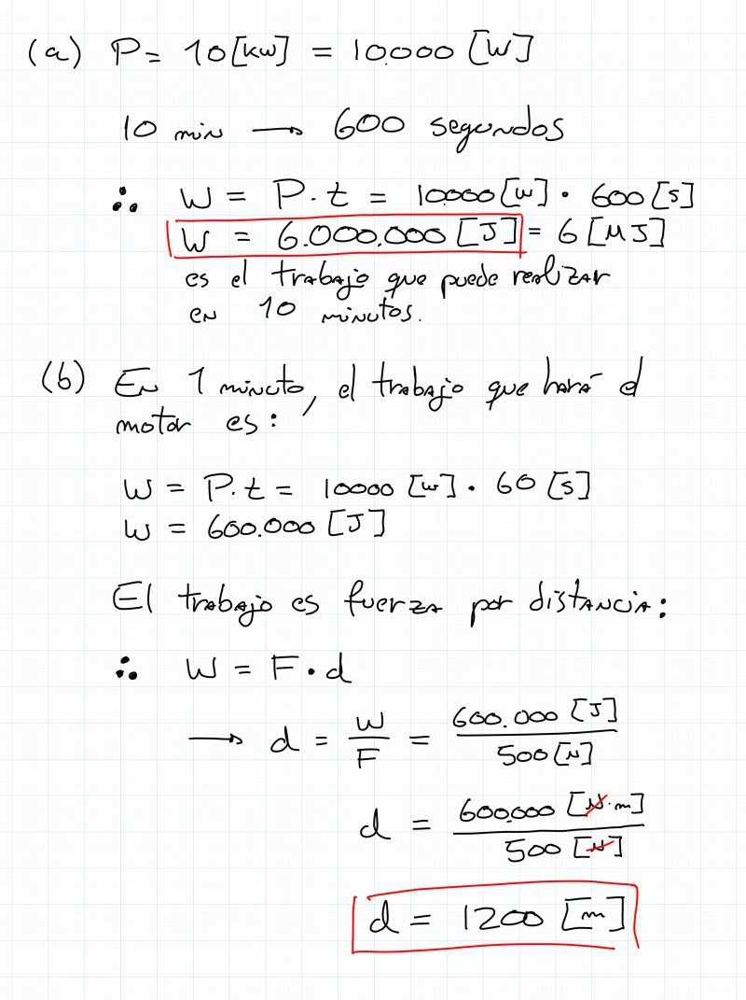
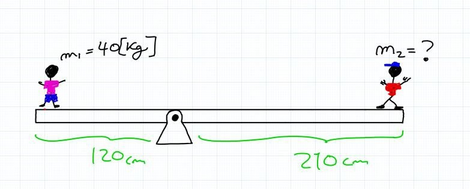
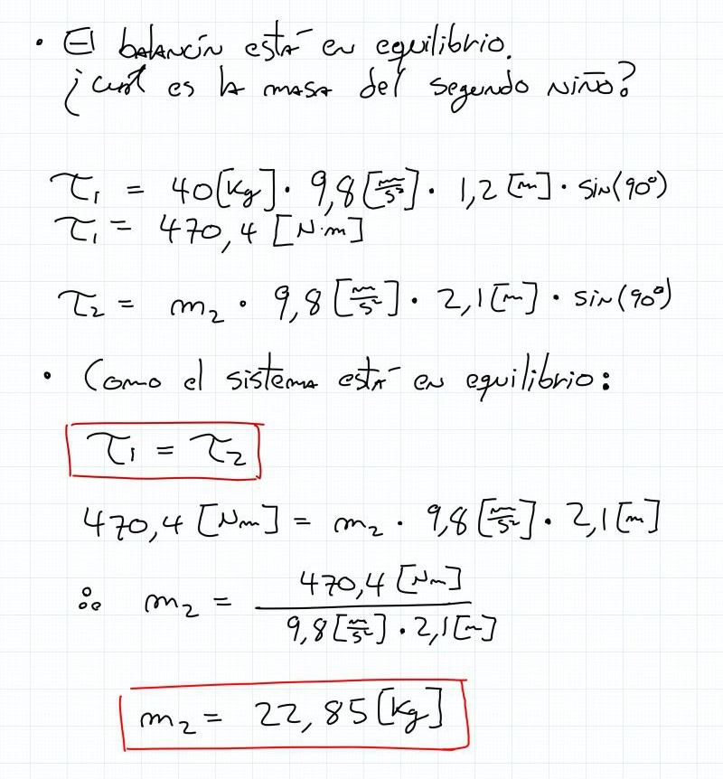
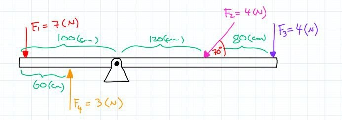
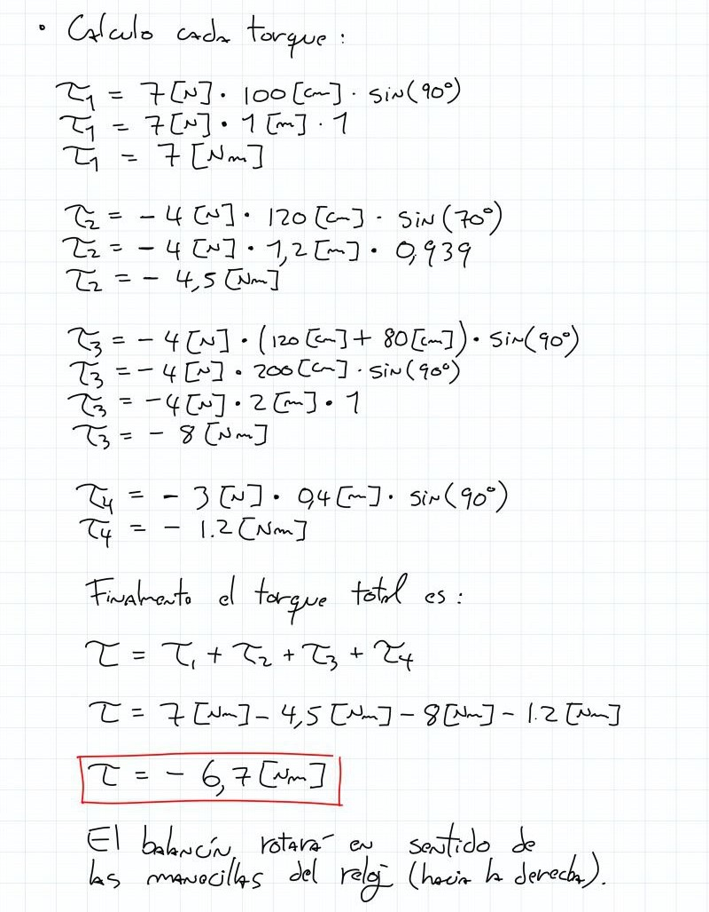

# ayudantía-06

viernes 22 septiembre 2023

## resumen

## ejercicio-01

Una pelota de $500 [gr]$ se deja caer desde una altura de $1.5[m]$. Sabemos que cada vez que rebota pierde el 15% de su energía mecánica.

calcule:

a) la energía mecánica de la pelota en el momento inicial.

b) la altura máxima que alcanza la pelota después del primer bote.

### --- solución ---

## ejercicio-02

una grúa eleva un bloque de $50[kg]$ a una altura de $8[m]$ en $4[s]$.

a) ¿Qué trabajo realizó la grúa?

b) ¿Qué potencia tiene la grúa? expreselo en KiloWatts.

### --- solución ---

## ejercicio-03

Si un auto eléctrico tiene un motor de $10[kW]$. Asumiendo una eficiencia del 100%, responda:

a) ¿qué trabajo es capaz de realizar el motor en 10 minutos?

b) si la fuerza máxima que puede aplicar el motor al auto es de $500[N]$. ¿qué distancia recorrerá en 1 minuto?

### --- solución ---

## ejercicio-04

dos niños se ubican en los extremos de un balancín asimétrico como muestra la figura:

Si el balancín está en equilibrio. ¿Cuál es la masa del niño de la derecha?

### --- solución ---

## ejercicio-05

en un balancín se aplican distintas fuerzas como se muestra en la figura.

a) ¿Cuál será el torque resultante?

b) ¿Hacia dónde girará el balancín?

### --- solución ---

