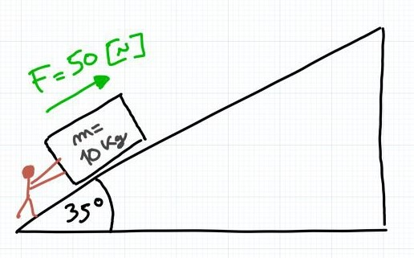
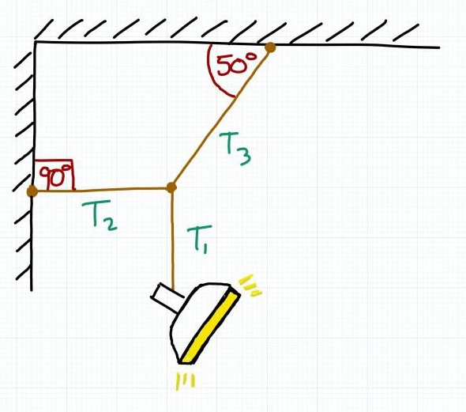
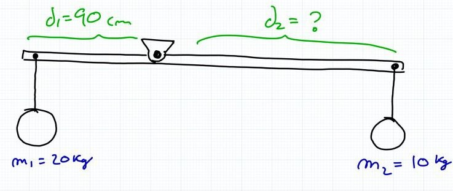

# control-02

viernes 29 septiembre 2023, presencial

instrucciones:

* control individual
* entregar soluciones en hojas con nombre, fecha, número de ejercicio
* responder máximo 3 de los 4 ejercicios
* evaluaremos los 2 mejores ejercicios que contesten, el tercero no cuenta

pauta:
* cada control tiene 1 punto base, más 3 puntos por cada ejercicio considerado
* cada ejercicio tiene parte a) y b), cada una de 1.5 puntos máximo donde:
    * 1.5 puntos si el proceso está completo, y el resultado es correcto
    * 1.0 puntos si el proceso está completo, pero el resultado tiene errores menores
    * 0.5 puntos si el proceso empezó bien, pero luego hubo errores graves y resultado incorrecto
    * 0.0 puntos si está en blanco o el resultado y el proceso tienen errores gravísimos

---

### consejos: 

- usa calculadora y los apuntes del curso
- no olvides las unidades de medida y sus transformaciones
- $1[N] = 1[kg\frac{m}{s^2}]$
- $g = 9.8 \left[\frac{m}{s^2}\right]$

## ejercicio-01 (3 puntos)

Mi primo Jorge necesita subir un mueble de $10 [kg]$ utilizando una rampa de $35°$. Jorge es capaz de empujar con una fuerza de $50[N]$.

a) ¿Será capaz Jorge de empujar el mueble por la rampa? Justifique su respuesta con cálculos. Asuma que no existe roce.

b) Si Jorge recibe ayuda de un amigo que es capaz de empujar con una fuerza de $30[N]$:
- ¿Serán capaces entre los dos de empujar el mueble por la rampa? 
- ¿Qué aceleración adquirirá el mueble mientras lo empujan?

## ejercicio-02 (3 puntos)

Un foco de iluminación profesional de 12 kg está suspendido sujeto por tres cuerdas interconectadas en equilibrio estable como se ve en la figura:

a) calcule la tensión que experimenta $T_1$

b) calcule la tensión que experimenta $T_2$ y $T_3$.

## ejercicio-03 (3 puntos)

Una barra con pivote giratorio como la que se muestra en la figura tiene en uno de sus extremos colgada una masa de $20[kg]$ a una distancia de $90[cm]$ del pivote.

a) Se necesita colgar una masa de $10[kg]$ en el otro extremo ¿A qué distancia del pivote se debe colocar para que la barra esté en equilibrio estático?

b) Si luego de que se cuelge la segunda masa en la distancia calculada en el punto (a), la masa aumenta a 20[kg]. Responda:
 - ¿hacia dónde girará la barra? calcule el torque resultante.
 - ¿a qué distancia hay que colocar la masa 1 para que se mantenga el equilibrio?

## ejercicio-04 (3 puntos)

Una grúa eleva una caja fuerte de $200[kg]$ a una altura de $20[m]$ en $10[s]$.

a) Calcule :

- la energía potencial de la caja fuerte al alcanzar la altura máxima.

- el trabajo que realizó.

- la potencia que tiene tiene la grúa en KiloWatts.

b) Si la grúa falla y deja caer la caja fuerte desde los $20[m]$, calcule la velocidad de la caja fuerte cuando esté a $8[m]$ del suelo.

    