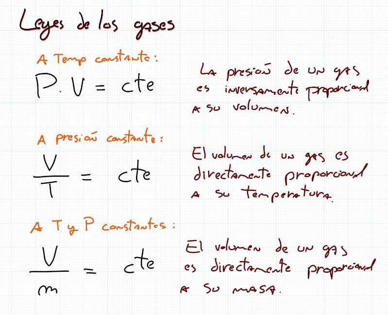
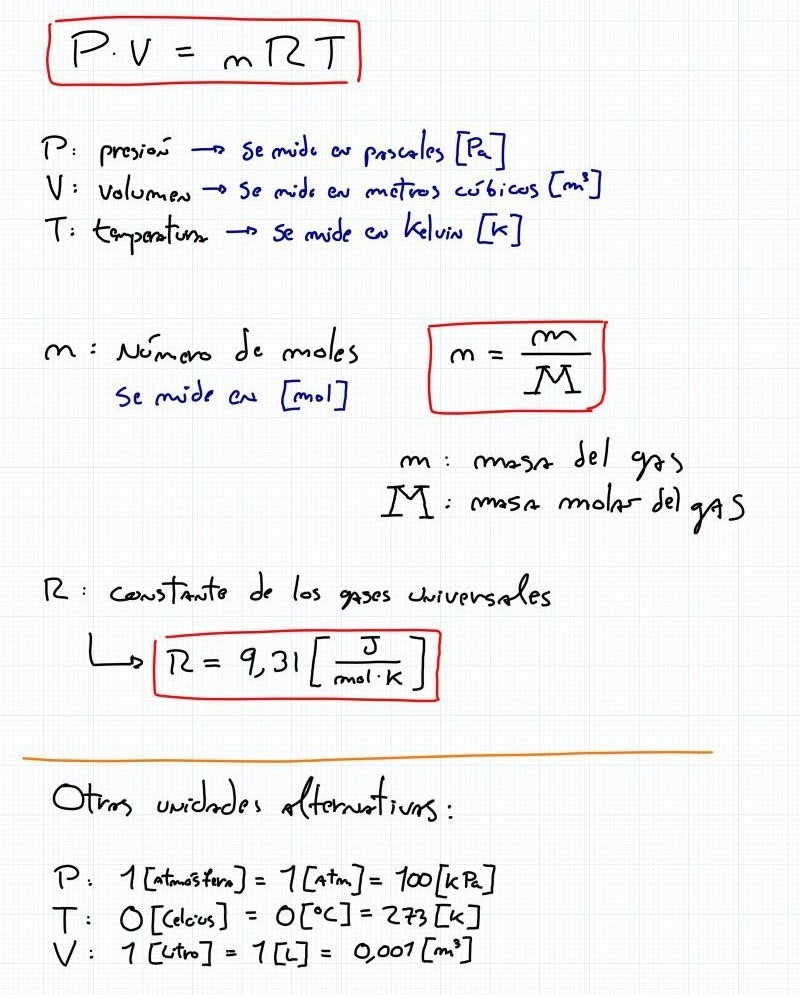
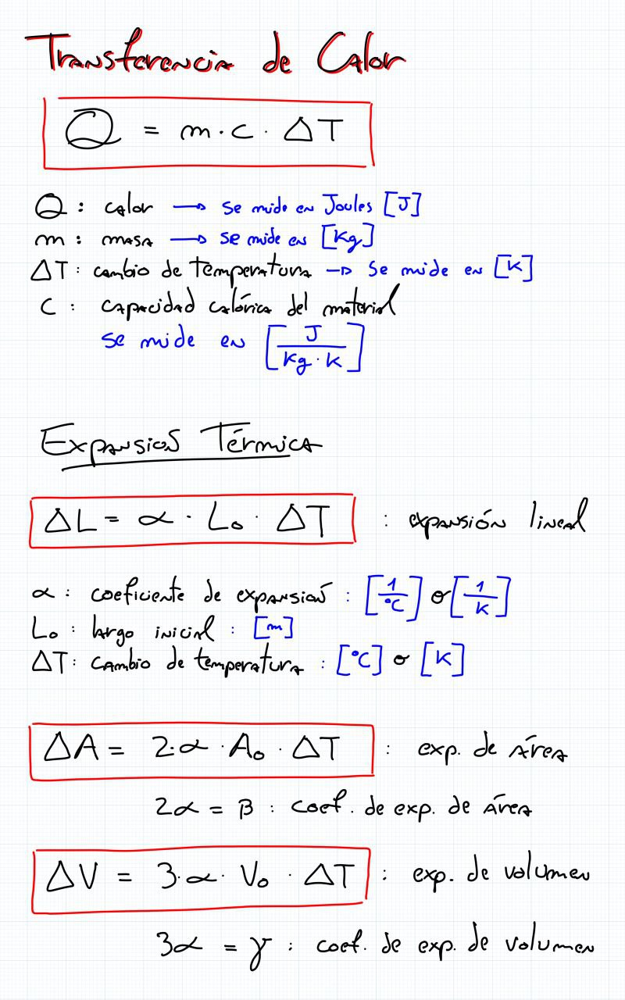

# ayudantía-08

viernes 06 octubre 2023

## resumen

## ejercicio-01

Un globo tiene un volumen de 4 L de aire a 27 ºC. Se le escapa a un niño y sube a dos kilómetros de altura, donde la temperatura es de -5 ºC ¿Cual será ahora el volumen del globo suponiendo la misma presión?

## ejercicio-02

¿Cuántos recipientes de $200[L]$ a $2[atm]$ de presión podrán llenarse con el gas propano contenido en un depósito de $500.000[L]$, que está a una presión de $4[atm]$? Suponer temperatura constante.

## ejercicio-03

Cuando una barra de metal es calentada de 20 ºC a 120 ºC, su longitud pasa de 1,5 m a 1,503 m. Calcule el coeficiente de
dilatación lineal de la barra.

## ejercicio-04

Un recipiente de vidrio tiene a $10 [°C]$ un volumen interno de $200 [mL]$. Determine el aumento del volumen interno de ese
recipiente cuando el mismo es calentado hasta $60 [°C]$. Considere el coeficiente de expansión vulométrico  $\gamma =3 \cdot 10^{-6} [1/°C]$. 

¿Cuál será su volumen total a $60 [°C]$?

¿Cuál es el coeficiente de expansión lineal del recipiente?

## ejercicio-05

Se mezclan $5 [L]$ de agua a $40[ºC]$ con $3[L]$ de alcohol a $15[ºC]$. ¿Cuál es su temperatura de equilibrio térmico?

$c_{agua} = 4180 [\frac{J}{Kg °C}]$

$c_{alcohol} = 2450 [\frac{J}{Kg °C}]$

$densidad_{alcohol} =0,79 [Kg/L]$ 

## ejercicio-06

Una figura de metal de $0.4 [Kg]$ que está a $180 [ºC]$ se enfría sumergiéndola en $1 [L]$ de agua a $10ºC$.

Si la temperatura de equilibrio resulta ser de $12[°C]$, determinar el calor específico del metal.

$c_{agua} = 4180 [\frac{J}{Kg °C}]$

