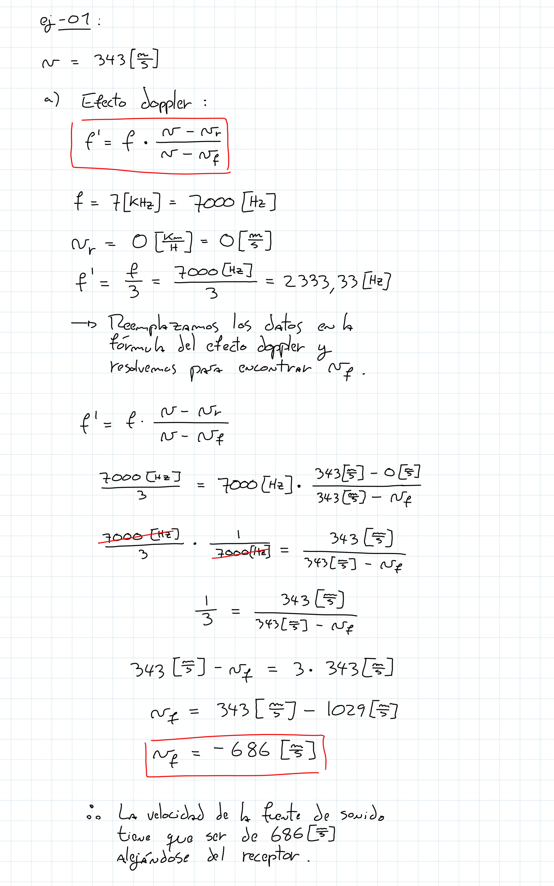
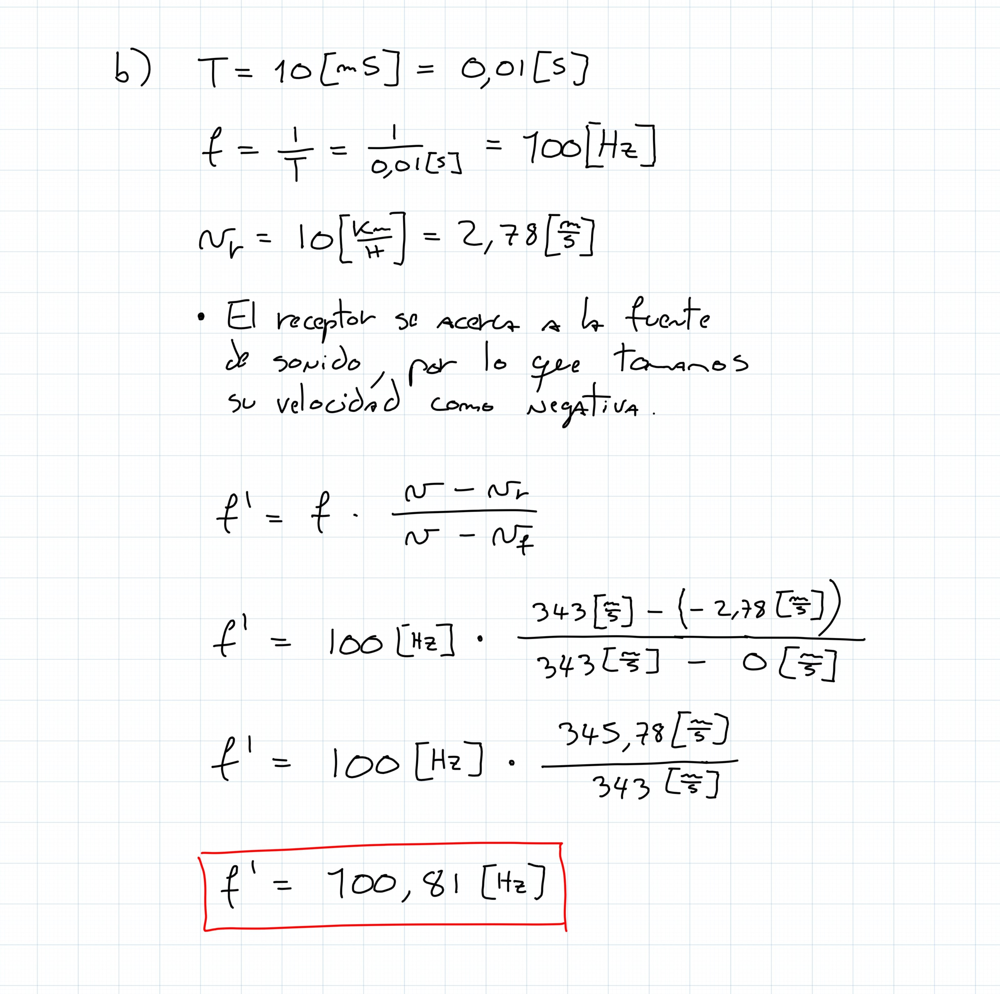
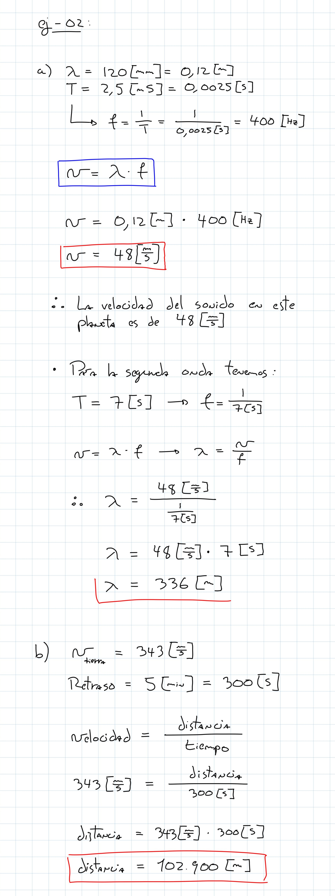
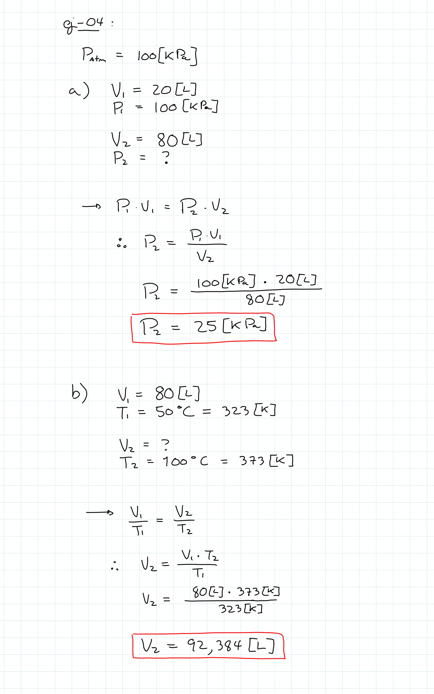

# control-03-pauta

viernes 20 octubre 2023, presencial

instrucciones:

* control individual
* entregar soluciones en hojas con nombre, fecha, número de ejercicio
* responder máximo 3 de los 4 ejercicios
* evaluaremos los 2 mejores ejercicios que contesten, el tercero no cuenta

pauta:
* cada control tiene 1 punto base, más 3 puntos por cada ejercicio considerado
* cada ejercicio tiene parte a) y b), cada una de 1.5 puntos máximo donde:
    * 1.5 puntos si el proceso está completo, y el resultado es correcto
    * 1.0 puntos si el proceso está completo, pero el resultado tiene errores menores
    * 0.5 puntos si el proceso empezó bien, pero luego hubo errores graves y resultado incorrecto
    * 0.0 puntos si está en blanco o el resultado y el proceso tienen errores gravísimos

---

### consejos: 

- usa calculadora y los apuntes del curso
- no olvides las unidades de medida!

## ejercicio-01: efecto Doppler (3 puntos)

datos:

$$v_{sonido \space tierra} = 343 \cdot \frac{m}{s}$$

a) si una fuente de sonido emite una frecuencia de 7 kHz, a qué velocidad debe alejarse de ti que estás con velocidad 0 km/h, para que cuando se aleje percibas una frecuencia igual a un tercio de la frecuencia original?

b) si una fuente emite un sonido con periodo de 10 milisegundos y se desplaza a una velocidad nula, y tu velocidad es de 10 km/h mientras te acercas hacia la fuente, qué frecuencia percibes?

### ***--- solución ---***

## ejercicio-02: velocidad del sonido (3 puntos)

datos:

$$v_{sonido \space tierra} = 343 \cdot \frac{m}{s}$$

a) cuál es la velocidad del sonido en otro planeta, si sabemos que una onda con longitud de onda igual a 120 milímetros, tiene un periodo de 2.5 milisegundos? y para otra onda en ese mismo material, cuál es su longitud de onda si el periodo es 7 segundos?

b) en la Tierra, a qué distancia tenemos que estar de una fuente sonora para tener un retraso mayor a 5 minutos? 

### ***--- solución ---***

## ejercicio-03: transferencia de calor (3 puntos)

datos:

$$c_{agua} = 4182 \frac{J}{kg \cdot K}$$

$$c_{oro} = 129 \frac{J}{kg \cdot K}$$

$$\rho_{agua} = 1 \cdot \frac{g}{cm^3}$$

a) cuánta energía necesitamos para subir la temperatura de tres litros de agua de 5 Celsius a 97 Celsius?

b) si tenemos una masa de agua de 20 kg a temperatura 10 grados Celsius, y sumergimos una masa de oro de 5kg a temperatura 2500 grados Celsius, cuál es la temperatura final de equilibrio?

### ***--- solución ---***

## ejercicio-04: gas ideal (3 puntos)

datos:

$$presión_{atmosférica}  = 100 \cdot kPa$$

a) si un gas está en un contenedor de 20 litros a presión atmosférica, cuál será su nueva presión si el volumen aumenta a 80 litros, y la temperatura se mantiene constante a 50 Celsius?

b) tras este cambio de presión y volumen, mantenemos constante la presión y subimos la temperatura de 50 Celsius a 100 Celsius, cuál es el nuevo volumen?

### ***--- solución ---***

