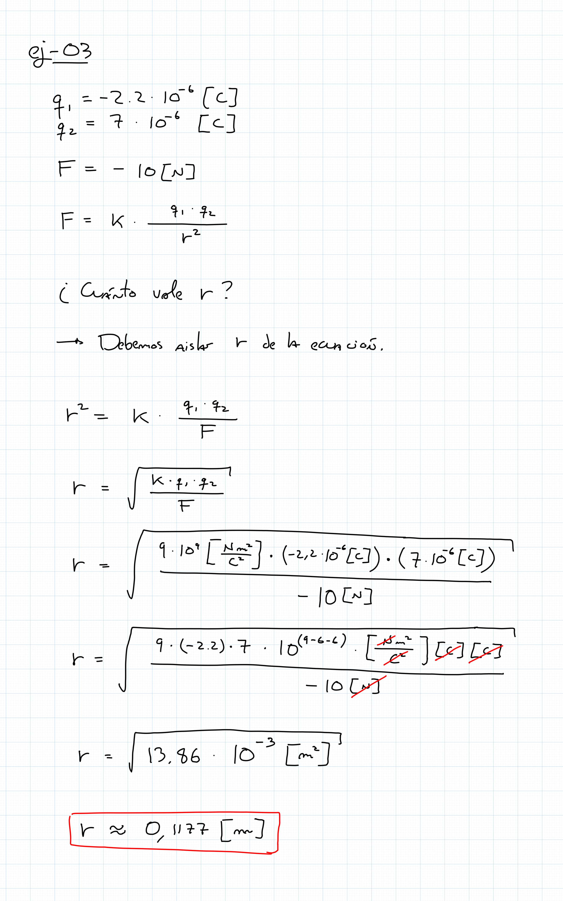
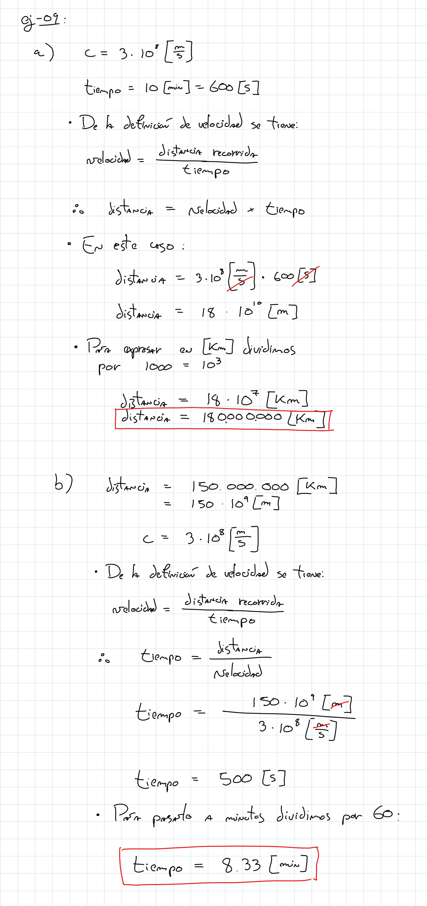

# ayudantía-11

jueves 9 noviembre 2023

## resumen

## ejercicio-01

Una carga de $5 \cdot 10^{-6} [C]$ se encuentra a $3 [m]$ de una carga de $-10\cdot10^{-6} [C]$

¿Cuál es la magnitud de la fuerza de atracción entre las cargas?

¿La fuerza es de atracción o repulsión?

## ejercicio-02

Una carga de $-4 \cdot 10^{-7} [C]$ ejerce una fuerza de $0.2 [N]$ a otra carga a una distancia de $0.3 [m]$ 

¿Cuál es el valor de la segunda carga? 

¿$q_2$ tiene carga positiva o negativa? 

¿Las cargas se atraen o se repelen?

## ejercicio-03

Dos cargas de $-2.2 \cdot 10^{-6} [C]$ y $7\cdot10^{-6} [C]$ se atraen con una fuerza de $-10[N]$.

¿A qué distancia se encuentran separadas? 

## ejercicio-04

a) ¿cuántos electrones equivalen a $32 \ [Coulomb]$?

b) cual es la fuerza eléctrica entre un protón y un electrón, separados por 0.1 mm? ¿es de atracción o repulsión?

datos:

$$q_{electron} = 1.6 \cdot 10^{-19} \cdot Coulomb$$

$$K \approx 9 \cdot 10^9 \cdot \frac{N \cdot m^2}{C^2}$$

## ejercicio-05

a) si el voltaje domiciliario en Chile es de $220 [V]$, y la corriente máxima que puede brindar un enchufe es de $10 [A]$ ¿cuánta es la potencia máxima que puede brindarnos? exprese el resultado en KiloWatts $[kW]$.

b) si un refrigerador consume una potencia promedio de $50 [W]$: 

- ¿cuánta corriente le pide al enchufe? 
- ¿cuántos [KWh] consume al mes? 
- ¿cuánto cuesta tenerlo prendido un mes entero si $1[KWh] = 100 [CLP]$?

## ejercicio-06

calcule la profundidad de color (cantidad de bits por pixel) y la cantidad total de colores que pueden representar los siguientes formatos de imágen digital:

a) blanco y negro

b) escala de grises a 2 bits por canal

c) escala de grises a 4 bits por canal

d) escala de grises a 8 bits por canal

e) RGB a 8 bits por canal

f) CMYK a 8 bits por canal

g) RGB a 10 bits por canal

h) CMYK a 12 bits por canal

## ejercicio-07

se tiene una imágen digital de 800 x 600 pixeles en formato CMYK de 8 bits por canal.

La imágen ocupa mucha memoria. Se decide comprimirla en formato JPG y su tamaño original se logra reducir en un 32%  

¿cuánta memoria en megabytes (MB) ocupa la imágen comprimida?

## ejercicio-08

Para una transmisión de video de:

- 2 minutos de duración
- 24 cuadros por segundo
- resolución de 800 x 600 pixeles por cuadro
- colores RGB de 4 bits por canal

a) ¿cuánta memoria ocupa en bits?

b) ¿cuánto tiempo demorará en transmitirse el video si tenemos una conexión a internet de 1 [Gigabits/s]?

## ejercicio-09

a) ¿cuánta distancia recorre la luz en el vacío durante 10 minutos? exprese la respuesta en kilómetros $[Km]$.

b) ¿cuántos minutos demora la luz del sol en llegar a la tierra si la distancia entre ambos astros es de $150.000.000 \ [Km]$? 

